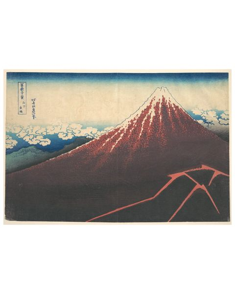

# sta426-exercise-week-1
<br />
<div align="center">
  <a href="image.jpg">
    
  </a>
<h3 align="center">Exercise 1</h3>

  <p align="center">
Repo for sta426 course exercise of week 1 </p>
</div>

<!-- GETTING STARTED -->
## terminal code chunk


* import python libraries
  ```terminal
  pip install opencv2
  pip install csv
  pip install os
  ```


## python code chunk 

```python
print('hello world')
```


## a few links
[Music link](https://www.youtube.com/watch?v=ddVv2FPuOk4)
</br>
[Website](https://2021.igem.org/Team:UNILausanne)

